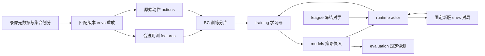

# 架构与数据契约

本文描述待实现的接口边界，不定义已经存在的 Python 类或函数。首版采用单机模块化设计，保留后续分离解码 worker、actor 和 learner 的可能，不立即引入分布式服务。

## 模块依赖方向

- `envs` 管理客户端与协议，不决定战术，也不偷偷下载缺失资源。
- `actions` 转换网络动作并检查合法性，不替策略选择开局或微操。
- `features` 负责版本化输入；不能依赖训练结果或对手池统计填充不可见敌方状态。
- `models` 接收张量，不读取录像文件、不启动游戏、不访问全局环境对象。
- `training` 计算监督或 RL 更新，不绕过 actor 的观测边界。
- `runtime` 负责调度、循环状态、行为概率与时间管理；`league` 为其提供冻结对手标识。
- `evaluation` 冻结模型和条件，不向 learner 回传评测轨迹作为训练数据。

## 数据契约

### 录像与比赛组

每条原始录像记录至少含来源、许可引用、文件 SHA-256、比赛组 ID、玩家视角、实际种族、时间、地图、引擎与数据版本，以及可用性／失败原因。未知项显式标记，不按名称猜测。

先对完全重复和同场不同副本分组，再分配集合。玩家视角和序列切片继承比赛组归属；同场两个玩家不是两个独立划分单位。训练集生成归一化统计和 Z 库，验证／测试集不参与。

### 观测与动作

观测含 game loop、合法实体／空间／标量信息、可见性和特征 schema。敌方历史快照应带时间或陈旧标识，不能当成当前真实状态。

动作保存原始 ability ID、规范化语义、选中实体、点／单位目标、排队属性、动作延迟及动作 schema。序列中应明确动作发生时间、动作前观测、同 loop 多命令及有效参数掩码。

实体 tag 到索引映射必须随该条观测绑定，不能跨时间或分片复用错误索引。未知能力、实体截断和标签无法对应都要计数或隔离，不能静默当作有效训练样本。

### RL 轨迹

至少记录合法观测、循环状态、采样动作、实际提交动作、有效掩码、行为策略 log probability、策略版本、对手 checkpoint、时间差、奖励、终局／截断原因及 bootstrap 信息。

行为概率必须对应真正使用的动作分布与掩码。动作被修正、拒绝或丢弃时保留原因，并明确是否仍可用于策略梯度；不能把另一动作的执行结果配给原概率。

保留 DI-star 的 V-trace、UPGO、教师 KL、TD(λ) 和熵项。改系数、回报或算法时单独记录；不能无说明替换 PPO。

### 策略与价值信息

执行策略默认只收己方合法观测；额外 critic 输入默认关闭。若启用，采用独立字段和分支，不进入 actor 输入、归一化、缓存或循环状态。

验收方式：给定相同合法观测和 actor 状态，改变仅供 critic 使用的信息，策略输出必须不变。离线 Z 可以来自训练录像的策略统计，但在线不能获取当前比赛未来。

### 检查点与评测

检查点关联代码 commit、配置和依赖哈希、模型／动作／特征 schema、初始化来源、训练预算及输入清单。续训恢复学习状态；人机运行只载入所需推理状态。

逐局评测记录引擎／地图、种子、实际出生侧、固定对手、模型哈希、胜负平、失败及延迟。客户端崩溃不是正常战败标签，不能无声删除失败局。

## 版本适配边界

历史样本由原引擎解码；新版规则由目标正式版引擎执行。可以映射语义、增加新动作或屏蔽失效动作，不能篡改旧资源数字来伪造新版状态转移。

`ResponsePing` 版本、地图哈希和启动配置需一致。配置缺失或不匹配即停止，不自动回退到最新版或旧版。最新正式版是交付目标，单轮实验始终使用固定版本。

原始依据、具体 DI-star 路径和迁移限制见[调研方案](SC2_TVT_RESEARCH_PLAN.md)。
